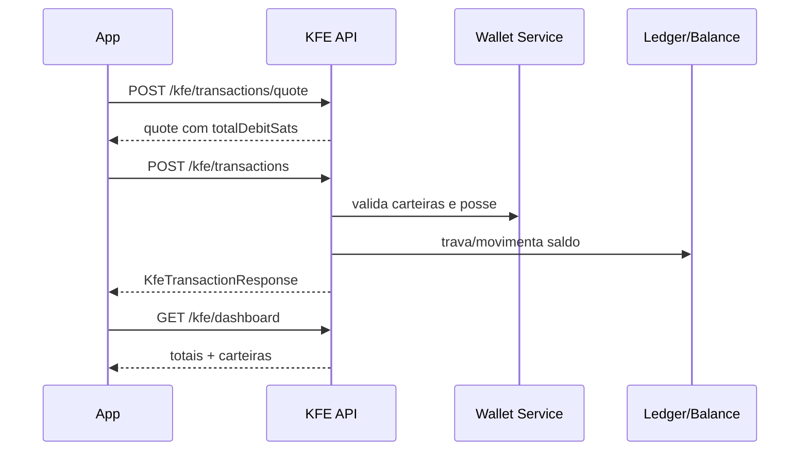

<!--
Kerosene documentation metadata
status: review-required
audience: internal
owner: kfe
source_of_truth: kfe
last_reviewed: 2026-09-26
-->

# KFE API

> Fonte de verdade desta página: controllers, DTOs, records, enums e `EndpointPolicyRegistry` do backend Spring Boot em `/src/main/java`.
> Quando uma rota existe no controller mas não está declarada no `EndpointPolicyRegistry`, ela é documentada como `DENIED_BY_DEFAULT`, porque `Security.anyRequest().denyAll()` bloqueia a chamada antes do método executar.

The current transaction routes are owned by the Payment Execution HTTP adapters:
`POST /kfe/transactions/quote`, `POST /kfe/transactions`, `GET /kfe/transactions`,
`GET /kfe/transactions/{transactionId}` and
`POST /kfe/transactions/{transactionId}/cancel`. See [validation status](../STATUS.md)
for the distinction between local contract evidence and production rollout.

## Convenções globais

### Provisionamento interno de carteira primária

`POST /internal/kfe/wallet-provisioning/primary` mantém autenticação interna e o DTO
`FinancialWalletProvisioningRequest`. HTTP 200 exige carteira `INTERNAL`, `ACTIVE` e
`spendable`; uma carteira em criação/bloqueada não satisfaz essa condição e não provoca
uma segunda criação. Uma carteira de outro tipo não substitui a primária.
Indisponibilidade do provedor continua falha; o consumidor Core não repete automaticamente
o POST. Consulte [recuperação do onboarding](../ONBOARDING_QUORUM_RECOVERY.md) para limites,
diagnóstico e diferença entre falha da resposta e rollback da conta.

### Envelope padrão `ApiResponse<T>`

A maior parte dos endpoints retorna o envelope abaixo. Endpoints explicitamente marcados como `raw` retornam o payload diretamente sem envelope. Campos `null` podem ser omitidos por `@JsonInclude`.

| Campo | Tipo | Nullable | Descrição | Exemplo |
|---|---:|:---:|---|---|
| `success` | boolean | não | Indica sucesso lógico da operação. | `true` |
| `message` | string | sim | Mensagem operacional retornada pelo controller/service. | `KFE wallet created.` |
| `data` | object/array/string | sim | Payload específico do endpoint. | `{...}` |
| `errorCode` | string | sim | Código de erro de negócio/validação quando `success=false`. | `AUTH_INVALID_CREDENTIALS` |
| `timestamp` | string date-time | não | Momento de montagem do envelope no servidor. | `2026-06-19T10:30:00` |

### Headers comuns

| Header | Tipo | Obrigatório | Quando usar | Exemplo |
|---|---:|:---:|---|---|
| `Content-Type` | string | sim em requests com body | Deve ser `application/json` para JSON. | `application/json` |
| `Authorization` | string | sim para `AUTHENTICATED`/`ADMIN` | Bearer token JWT emitido por login/TOTP/passkey/device-key. | `Bearer eyJhbGciOi...` |
| `X-Correlation-Id` | string | não | Correlação distribuída entre serviços/logs. Aceita caracteres seguros de 8 a 64 posições. | `req-20260619-0001` |
| `X-Request-Id` | string | não | Identificador idempotente/observável da requisição. | `mobile-01HD...` |
| `X-Device-Hash` | string | condicional | Usado por endpoints device-scoped de segurança/PIN. | `sha256:abc123...` |
| `X-Idempotency-Key` | string | recomendado | Recomendado em operações financeiras, embora KFE use `idempotencyKey` no body. | `txn-01J...` |

### Classes de autenticação

| Valor na documentação | Significado efetivo |
|---|---|
| `PUBLIC` | Permitido sem JWT. |
| `AUTHENTICATED` | Exige JWT válido. |
| `ADMIN` | Exige JWT com role `ADMIN`; alguns métodos também usam `@PreAuthorize`. |
| `DENIED_BY_DEFAULT` | Controller/DTO pode existir, mas a rota não tem policy e é bloqueada por `anyRequest().denyAll()`. |
| `STALE` | Documento legado sem controller ativo confirmado no código atual. |

### Estruturas de erro

Erro via envelope `ApiResponse`:

```json
{
  "success": false,
  "message": "Invalid token context",
  "data": null,
  "errorCode": "AUTH_SESSION_EXPIRED",
  "timestamp": "2026-06-19T10:30:00"
}
```

Erro MVC/validação ou fallback pode aparecer como `ResponseError`/erro Spring, dependendo do ponto da falha:

```json
{
  "timestamp": "2026-06-19T10:30:00",
  "status": "BAD_REQUEST",
  "error": "Bad Request",
  "message": "Validation failed",
  "path": "/auth/signup"
}
```

### Status codes comuns

| Status | Quando ocorre | Como resolver |
|---:|---|---|
| `200 OK` | Consulta ou operação concluída. | Consumir `data`. |
| `201 Created` | Recurso criado. | Persistir o `id` retornado. |
| `202 Accepted` | Fluxo assíncrono/pendente, comum em login com TOTP/aprovação. | Continuar no próximo passo indicado. |
| `204 No Content` | Operação concluída sem corpo. | Não tentar parsear JSON. |
| `400 Bad Request` | JSON inválido, campo faltante, enum inválido ou regra básica violada. | Corrigir request body/query/path. |
| `401 Unauthorized` | JWT ausente/inválido/expirado ou credencial incorreta. | Fazer login/renovar token ou reenviar credenciais. |
| `403 Forbidden` | Usuário autenticado sem permissão, admin token inválido ou policy nega acesso. | Verificar role/headers/policy. |
| `404 Not Found` | Recurso, sessão, dispositivo ou endpoint não encontrado. | Verificar identificadores. |
| `409 Conflict` | Duplicidade/idempotência/conflito de estado. | Consultar recurso existente ou trocar chave idempotente. |
| `410 Gone` | Sessão de recuperação expirada. | Reiniciar o fluxo. |
| `412 Precondition Failed` | Pré-condição criptográfica/security step-up falhou. | Refazer challenge/assinatura/fator. |
| `422 Unprocessable Entity` | Regra de negócio não satisfeita. | Ajustar estado da conta/recurso antes de repetir. |
| `429 Too Many Requests` | Rate limit. | Aplicar backoff exponencial. |
| `500 Internal Server Error` | Falha não tratada. | Registrar `X-Correlation-Id` e abrir incidente. |
| `503 Service Unavailable` | Dependência indisponível ou health `DOWN`. | Tentar novamente ou acionar operação. |

## Visão geral do serviço

API financeira principal do backend: carteiras, dashboard, capacidades de recebimento, quote, submissão de transações e auditoria administrativa. É o conjunto ativo para o app financeiro.


## Diagrama de fluxo KFE




## Endpoints

## Create KFE wallet

**Método e URL:** `POST /kfe/wallets`
**Autenticação efetiva:** `AUTHENTICATED`
**Tipo de resposta:** `ApiResponse envelope`

**O que faz:** Cria uma carteira financeira KFE para o usuário autenticado.

**Quando usar:** Use na criação de carteira interna, custodial on-chain ou cold/watch-only.

**Regras de negócio e limitações:** Existe limitação de uma carteira ativa/em criação para `INTERNAL` e `CUSTODIAL_ONCHAIN`; `WATCH_ONLY` aceita no máximo duas carteiras ativas/em criação por usuário e exige material público como xpub/descriptor quando usado como cold wallet. `issueInitialAddress=true` tenta emitir endereço inicial.

### Headers obrigatórios

| Nome | Tipo | Obrigatório | Descrição | Exemplo |
|---|---|---|---|---|
| Authorization | string | sim | Bearer JWT com permissão adequada. | Bearer <JWT> |
| Content-Type | string | sim | JSON request body. | application/json |

### Headers opcionais

| Nome | Tipo | Descrição | Exemplo |
|---|---|---|---|
| X-Correlation-Id | string | Rastreabilidade fim a fim. | req-20260619-0001 |
| X-Request-Id | string | Identificador do cliente para logs. | mobile-01J... |

### Path Parameters

| Nome | Tipo | Obrigatório | Descrição | Exemplo | Restrições |
|---|---|---|---|---|---|
| Nenhum | - | - | - | - | - |

### Query Parameters

| Nome | Tipo | Obrigatório | Default | Descrição | Exemplo |
|---|---|---|---|---|---|
| Nenhum | - | - | - | - | - |

### Request Body

| Campo | Tipo | Obrigatório | Nullable | Default | Validações | Descrição | Exemplo |
|---|---|---|---|---|---|---|---|
| kind | KfeWalletKind | sim | não | - | @NotNull; INTERNAL|CUSTODIAL_ONCHAIN|WATCH_ONLY | Método de custódia. | INTERNAL |
| name | KfeWalletName | não | sim | - | INVESTMENT|DAILY|VEHICLE|FUTURE_EXPENSES | Nome controlado da carteira. | DAILY |
| label | string | não | sim | - | max 96 | Rótulo livre. | Dia a dia |
| xpub | string | condicional | sim | - | requerido para watch-only sem descriptor | Extended public key. | xpub... |
| descriptor | string | não | sim | - | descriptor Bitcoin | Descriptor/script policy. | wpkh([abcd1234/84h/0h/0h]xpub...) |
| fingerprint | string | não | sim | - | hex fingerprint | Fingerprint da chave master. | abcd1234 |
| derivationPath | string | não | sim | - | BIP path | Caminho base. | m/84h/0h/0h |
| initialAddress | string | não | sim | - | endereço BTC | Endereço inicial fornecido pelo cliente. | bc1q... |
| initialAddressDerivationPath | string | não | sim | - | BIP path | Path do endereço inicial. | m/84h/0h/0h/0/0 |
| initialAddressDerivationIndex | integer | não | sim | - | >=0 quando usado | Índice do endereço. | 0 |
| initialAddressProviderReference | string | não | sim | - | livre | Referência do provedor. | btcpay-address-id |
| issueInitialAddress | boolean | não | sim | false | boolean | Pedir emissão inicial ao backend. | true |

Exemplo de body:

```json
{
  "kind": "WATCH_ONLY",
  "name": "INVESTMENT",
  "label": "Cold wallet principal",
  "xpub": "xpub6CUGRU...",
  "fingerprint": "abcd1234",
  "derivationPath": "m/84h/0h/0h",
  "issueInitialAddress": true
}
```

### Exemplo de requisição

```bash
curl -X POST 'http://localhost:8080/kfe/wallets' \
  -H 'Accept: application/json' \
  -H 'Authorization: Bearer <JWT>' \
  -H 'Content-Type: application/json' \
  --data '{
  "kind": "WATCH_ONLY",
  "name": "INVESTMENT",
  "label": "Cold wallet principal",
  "xpub": "xpub6CUGRU...",
  "fingerprint": "abcd1234",
  "derivationPath": "m/84h/0h/0h",
  "issueInitialAddress": true
}'
```

### Response de sucesso

**Status:** `201 Created`
**Descrição:** Carteira criada.

Campos retornados:

| Campo | Tipo | Nullable | Descrição | Exemplo |
|---|---|---|---|---|
| data.id | uuid | não | Identificador da carteira. | 018f... |
| data.kind | enum | não | INTERNAL, CUSTODIAL_ONCHAIN ou WATCH_ONLY. | INTERNAL |
| data.status | enum | não | CREATING, ACTIVE, FROZEN, ROTATING_ADDRESS, KEYGEN_FAILED, QUORUM_BLOCKED, ARCHIVED. | ACTIVE |
| data.label | string | sim | Rótulo personalizado. | Carteira diária |
| data.walletName | string | sim | Nome controlado: INVESTMENT, DAILY, VEHICLE, FUTURE_EXPENSES. | DAILY |
| data.walletTypeDescription | string | sim | Descrição humana do tipo. | Carteira interna |
| data.asset | string | não | Ativo da carteira. | BTC |
| data.spendable | boolean | não | Indica se a carteira pode originar gasto. | true |
| data.xpubConfigured | boolean | não | Indica se há xpub/descriptor configurado. | false |
| data.mpcKeyConfigured | boolean | não | Indica se chave MPC foi configurada. | true |
| data.activeAddress | string | sim | Endereço de recebimento ativo. | bc1q... |
| data.createdAt | date-time | não | Criação. | 2026-06-19T10:30:00 |
| data.updatedAt | date-time | não | Última atualização. | 2026-06-19T10:31:00 |

Exemplo completo:

```json
{
  "success": true,
  "message": "KFE wallet created.",
  "data": {
    "id": "018f0000-0000-7000-8000-000000000001",
    "kind": "WATCH_ONLY",
    "status": "ACTIVE",
    "label": "Cold wallet principal",
    "walletName": "INVESTMENT",
    "walletTypeDescription": "Cold wallet observável",
    "asset": "BTC",
    "spendable": false,
    "xpubConfigured": true,
    "mpcKeyConfigured": false,
    "activeAddress": "bc1qexample",
    "createdAt": "2026-06-19T10:30:00",
    "updatedAt": "2026-06-19T10:30:00"
  },
  "timestamp": "2026-06-19T10:30:00"
}
```

### Status codes específicos

| Status | Nome | Quando ocorre | Como resolver |
|---|---|---|---|
| 201 | Created | Operação descrita acima. | Consumir response conforme schema. |
| 400 | Bad Request | Enum inválido, label > 96, xpub/descriptor inválido. | Corrigir payload. |
| 409 | Conflict | Já existe carteira ativa/em criação para o mesmo kind. | Usar carteira existente ou arquivar a anterior no backend quando suportado. |
| 422 | Unprocessable Entity | Regra financeira/custódia não satisfeita. | Ajustar configuração da carteira. |

### Exemplo de erro

```json
{
  "success": false,
  "message": "Request rejected or validation failed",
  "data": null,
  "errorCode": "VALIDATION_ERROR",
  "timestamp": "2026-06-19T10:30:00"
}
```

## List KFE wallets

**Método e URL:** `GET /kfe/wallets`
**Autenticação efetiva:** `AUTHENTICATED`
**Tipo de resposta:** `ApiResponse envelope`

**O que faz:** Lista as carteiras KFE do usuário autenticado.

**Quando usar:** Use para telas de carteiras e seleção de origem/destino.

**Regras de negócio e limitações:** Retorna somente carteiras pertencentes ao usuário do JWT.

### Headers obrigatórios

| Nome | Tipo | Obrigatório | Descrição | Exemplo |
|---|---|---|---|---|
| Authorization | string | sim | Bearer JWT com permissão adequada. | Bearer <JWT> |

### Headers opcionais

| Nome | Tipo | Descrição | Exemplo |
|---|---|---|---|
| X-Correlation-Id | string | Rastreabilidade fim a fim. | req-20260619-0001 |
| X-Request-Id | string | Identificador do cliente para logs. | mobile-01J... |

### Path Parameters

| Nome | Tipo | Obrigatório | Descrição | Exemplo | Restrições |
|---|---|---|---|---|---|
| Nenhum | - | - | - | - | - |

### Query Parameters

| Nome | Tipo | Obrigatório | Default | Descrição | Exemplo |
|---|---|---|---|---|---|
| Nenhum | - | - | - | - | - |

### Request Body

Este endpoint não recebe body.


### Exemplo de requisição

```bash
curl -X GET 'http://localhost:8080/kfe/wallets' \
  -H 'Accept: application/json' \
  -H 'Authorization: Bearer <JWT>'
```

### Response de sucesso

**Status:** `200 OK`
**Descrição:** Operação concluída.

Campos retornados:

| Campo | Tipo | Nullable | Descrição | Exemplo |
|---|---|---|---|---|
| data[] | array<KfeWalletResponse> | não | Lista de carteiras; cada item contém todos os campos de `KfeWalletResponse`. | [{...}] |
| data.id | uuid | não | Identificador da carteira. | 018f... |
| data.kind | enum | não | INTERNAL, CUSTODIAL_ONCHAIN ou WATCH_ONLY. | INTERNAL |
| data.status | enum | não | CREATING, ACTIVE, FROZEN, ROTATING_ADDRESS, KEYGEN_FAILED, QUORUM_BLOCKED, ARCHIVED. | ACTIVE |
| data.label | string | sim | Rótulo personalizado. | Carteira diária |
| data.walletName | string | sim | Nome controlado: INVESTMENT, DAILY, VEHICLE, FUTURE_EXPENSES. | DAILY |
| data.walletTypeDescription | string | sim | Descrição humana do tipo. | Carteira interna |
| data.asset | string | não | Ativo da carteira. | BTC |
| data.spendable | boolean | não | Indica se a carteira pode originar gasto. | true |
| data.xpubConfigured | boolean | não | Indica se há xpub/descriptor configurado. | false |
| data.mpcKeyConfigured | boolean | não | Indica se chave MPC foi configurada. | true |
| data.activeAddress | string | sim | Endereço de recebimento ativo. | bc1q... |
| data.createdAt | date-time | não | Criação. | 2026-06-19T10:30:00 |
| data.updatedAt | date-time | não | Última atualização. | 2026-06-19T10:31:00 |

Exemplo completo:

```json
{
  "success": true,
  "message": "KFE wallets retrieved.",
  "data": [
    {
      "id": "018f0000-0000-7000-8000-000000000001",
      "kind": "INTERNAL",
      "status": "ACTIVE",
      "label": "Dia a dia",
      "walletName": "DAILY",
      "walletTypeDescription": "Carteira interna",
      "asset": "BTC",
      "spendable": true,
      "xpubConfigured": false,
      "mpcKeyConfigured": true,
      "activeAddress": null,
      "createdAt": "2026-06-19T10:30:00",
      "updatedAt": "2026-06-19T10:30:00"
    }
  ],
  "timestamp": "2026-06-19T10:30:00"
}
```

### Status codes específicos

| Status | Nome | Quando ocorre | Como resolver |
|---|---|---|---|
| 200 | OK | Operação descrita acima. | Consumir response conforme schema. |
| 401 | Unauthorized | JWT ausente, inválido ou expirado. | Refazer autenticação. |
| 403 | Forbidden | Token sem permissão ou policy nega acesso. | Validar role/policy. |

### Exemplo de erro

```json
{
  "success": false,
  "message": "Request rejected or validation failed",
  "data": null,
  "errorCode": "VALIDATION_ERROR",
  "timestamp": "2026-06-19T10:30:00"
}
```

## List wallet name options

**Método e URL:** `GET /kfe/wallets/names`
**Autenticação efetiva:** `AUTHENTICATED`
**Tipo de resposta:** `ApiResponse envelope`

**O que faz:** Lista nomes controlados aceitos para carteiras.

**Quando usar:** Use para preencher dropdowns de criação/edição.

**Regras de negócio e limitações:** Valores aceitos pelo enum `KfeWalletName`.

### Headers obrigatórios

| Nome | Tipo | Obrigatório | Descrição | Exemplo |
|---|---|---|---|---|
| Authorization | string | sim | Bearer JWT com permissão adequada. | Bearer <JWT> |

### Headers opcionais

| Nome | Tipo | Descrição | Exemplo |
|---|---|---|---|
| X-Correlation-Id | string | Rastreabilidade fim a fim. | req-20260619-0001 |
| X-Request-Id | string | Identificador do cliente para logs. | mobile-01J... |

### Path Parameters

| Nome | Tipo | Obrigatório | Descrição | Exemplo | Restrições |
|---|---|---|---|---|---|
| Nenhum | - | - | - | - | - |

### Query Parameters

| Nome | Tipo | Obrigatório | Default | Descrição | Exemplo |
|---|---|---|---|---|---|
| Nenhum | - | - | - | - | - |

### Request Body

Este endpoint não recebe body.


### Exemplo de requisição

```bash
curl -X GET 'http://localhost:8080/kfe/wallets/names' \
  -H 'Accept: application/json' \
  -H 'Authorization: Bearer <JWT>'
```

### Response de sucesso

**Status:** `200 OK`
**Descrição:** Operação concluída.

Campos retornados:

| Campo | Tipo | Nullable | Descrição | Exemplo |
|---|---|---|---|---|
| data[].name | enum | não | INVESTMENT, DAILY, VEHICLE, FUTURE_EXPENSES. | DAILY |
| data[].label | string | não | Label humano em pt-BR. | Dia a dia |

Exemplo completo:

```json
{
  "success": true,
  "message": "KFE wallet names retrieved.",
  "data": [
    {
      "name": "INVESTMENT",
      "label": "Investimento"
    },
    {
      "name": "DAILY",
      "label": "Dia a dia"
    }
  ],
  "timestamp": "2026-06-19T10:30:00"
}
```

### Status codes específicos

| Status | Nome | Quando ocorre | Como resolver |
|---|---|---|---|
| 200 | OK | Operação descrita acima. | Consumir response conforme schema. |
| 401 | Unauthorized | JWT ausente, inválido ou expirado. | Refazer autenticação. |
| 403 | Forbidden | Token sem permissão ou policy nega acesso. | Validar role/policy. |

### Exemplo de erro

```json
{
  "success": false,
  "message": "Request rejected or validation failed",
  "data": null,
  "errorCode": "VALIDATION_ERROR",
  "timestamp": "2026-06-19T10:30:00"
}
```

## Rotate wallet address

**Método e URL:** `POST /kfe/wallets/{walletId}/addresses/rotate`
**Autenticação efetiva:** `AUTHENTICATED`
**Tipo de resposta:** `ApiResponse envelope`

**O que faz:** Emite/ativa um novo endereço de recebimento para uma carteira.

**Quando usar:** Use quando uma carteira interna/custodial precisa de endereço ativo para depósito/recebimento.

**Regras de negócio e limitações:** `WATCH_ONLY` pode ser bloqueada pelo serviço; cold wallet deve nascer com endereço inicial quando importada. Exige propriedade da carteira.

### Headers obrigatórios

| Nome | Tipo | Obrigatório | Descrição | Exemplo |
|---|---|---|---|---|
| Authorization | string | sim | Bearer JWT com permissão adequada. | Bearer <JWT> |

### Headers opcionais

| Nome | Tipo | Descrição | Exemplo |
|---|---|---|---|
| X-Correlation-Id | string | Rastreabilidade fim a fim. | req-20260619-0001 |
| X-Request-Id | string | Identificador do cliente para logs. | mobile-01J... |

### Path Parameters

| Nome | Tipo | Obrigatório | Descrição | Exemplo | Restrições |
|---|---|---|---|---|---|
| walletId | uuid | sim | Carteira que receberá novo endereço. | 018f0000-0000-7000-8000-000000000001 | UUID válido |

### Query Parameters

| Nome | Tipo | Obrigatório | Default | Descrição | Exemplo |
|---|---|---|---|---|---|
| Nenhum | - | - | - | - | - |

### Request Body

Este endpoint não recebe body.


### Exemplo de requisição

```bash
curl -X POST 'http://localhost:8080/kfe/wallets/{walletId}/addresses/rotate' \
  -H 'Accept: application/json' \
  -H 'Authorization: Bearer <JWT>'
```

### Response de sucesso

**Status:** `200 OK`
**Descrição:** Operação concluída.

Campos retornados:

| Campo | Tipo | Nullable | Descrição | Exemplo |
|---|---|---|---|---|
| data.id | uuid | não | ID do endereço. | 018f... |
| data.walletId | uuid | não | ID da carteira. | 018f... |
| data.address | string | não | Endereço BTC. | bc1q... |
| data.role | enum | não | Papel do endereço. | RECEIVE |
| data.status | enum | não | Status do endereço. | ACTIVE |
| data.derivationPath | string | sim | Caminho derivado. | m/84h/0h/0h/0/1 |
| data.derivationIndex | integer | sim | Índice derivado. | 1 |
| data.providerReference | string | sim | Referência externa. | btcpay... |
| data.createdAt | date-time | não | Criação. | 2026-06-19T10:30:00 |
| data.retiredAt | date-time | sim | Retirada. | null |

Exemplo completo:

```json
{
  "success": true,
  "message": "KFE wallet address rotated.",
  "data": {
    "id": "018f0000-0000-7000-8000-000000000010",
    "walletId": "018f0000-0000-7000-8000-000000000001",
    "address": "bc1qexample",
    "role": "RECEIVE",
    "status": "ACTIVE",
    "derivationPath": "m/84h/0h/0h/0/1",
    "derivationIndex": 1,
    "providerReference": null,
    "createdAt": "2026-06-19T10:30:00",
    "retiredAt": null
  },
  "timestamp": "2026-06-19T10:30:00"
}
```

### Status codes específicos

| Status | Nome | Quando ocorre | Como resolver |
|---|---|---|---|
| 200 | OK | Operação descrita acima. | Consumir response conforme schema. |
| 401 | Unauthorized | JWT ausente, inválido ou expirado. | Refazer autenticação. |
| 403 | Forbidden | Token sem permissão ou policy nega acesso. | Validar role/policy. |

### Exemplo de erro

```json
{
  "success": false,
  "message": "Request rejected or validation failed",
  "data": null,
  "errorCode": "VALIDATION_ERROR",
  "timestamp": "2026-06-19T10:30:00"
}
```

## List cold wallet UTXOs

**Método e URL:** `GET /kfe/wallets/{walletId}/utxos`
**Autenticação efetiva:** `AUTHENTICATED`
**Tipo de resposta:** `ApiResponse envelope`

**O que faz:** Lista UTXOs observáveis da carteira cold/watch-only.

**Quando usar:** Use antes de montar PSBT para escolher inputs disponíveis.

**Regras de negócio e limitações:** Depende de backend/indexador/provedor que consiga observar UTXOs da carteira. Exige propriedade da carteira.

### Headers obrigatórios

| Nome | Tipo | Obrigatório | Descrição | Exemplo |
|---|---|---|---|---|
| Authorization | string | sim | Bearer JWT com permissão adequada. | Bearer <JWT> |

### Headers opcionais

| Nome | Tipo | Descrição | Exemplo |
|---|---|---|---|
| X-Correlation-Id | string | Rastreabilidade fim a fim. | req-20260619-0001 |
| X-Request-Id | string | Identificador do cliente para logs. | mobile-01J... |

### Path Parameters

| Nome | Tipo | Obrigatório | Descrição | Exemplo | Restrições |
|---|---|---|---|---|---|
| walletId | uuid | sim | Carteira watch-only/cold wallet. | 018f0000-0000-7000-8000-000000000001 | UUID válido |

### Query Parameters

| Nome | Tipo | Obrigatório | Default | Descrição | Exemplo |
|---|---|---|---|---|---|
| Nenhum | - | - | - | - | - |

### Request Body

Este endpoint não recebe body.


### Exemplo de requisição

```bash
curl -X GET 'http://localhost:8080/kfe/wallets/{walletId}/utxos' \
  -H 'Accept: application/json' \
  -H 'Authorization: Bearer <JWT>'
```

### Response de sucesso

**Status:** `200 OK`
**Descrição:** Operação concluída.

Campos retornados:

| Campo | Tipo | Nullable | Descrição | Exemplo |
|---|---|---|---|---|
| data[].txid | string | não | Transaction id. | abc... |
| data[].vout | integer | não | Output index. | 0 |
| data[].valueSats | long | não | Valor em satoshis. | 100000 |
| data[].scriptPubKey | string | sim | Script pubkey. | 0014... |
| data[].address | string | sim | Endereço associado. | bc1q... |

Exemplo completo:

```json
{
  "success": true,
  "message": "KFE cold wallet UTXOs retrieved.",
  "data": [
    {
      "txid": "abc123",
      "vout": 0,
      "valueSats": 100000,
      "scriptPubKey": "0014abcd",
      "address": "bc1qexample"
    }
  ],
  "timestamp": "2026-06-19T10:30:00"
}
```

### Status codes específicos

| Status | Nome | Quando ocorre | Como resolver |
|---|---|---|---|
| 200 | OK | Operação descrita acima. | Consumir response conforme schema. |
| 401 | Unauthorized | JWT ausente, inválido ou expirado. | Refazer autenticação. |
| 403 | Forbidden | Token sem permissão ou policy nega acesso. | Validar role/policy. |

### Exemplo de erro

```json
{
  "success": false,
  "message": "Request rejected or validation failed",
  "data": null,
  "errorCode": "VALIDATION_ERROR",
  "timestamp": "2026-06-19T10:30:00"
}
```

## Create cold wallet PSBT

**Método e URL:** `POST /kfe/wallets/{walletId}/cold-wallet/psbt`
**Autenticação efetiva:** `AUTHENTICATED`
**Tipo de resposta:** `ApiResponse envelope`

**O que faz:** Monta uma PSBT para carteira cold/watch-only, sem assinar.

**Quando usar:** Use para fluxo de retirada offline: backend monta PSBT, usuário assina fora e outro endpoint futuro deverá transmitir.

**Regras de negócio e limitações:** Valida dust mínimo `amountSats >= 546`; `confirmationTarget` e `feeRateSatsPerVbyte` devem ser >=1 quando presentes; inputs são opcionais, mas se enviados cada input exige `txid` e `vout`.

### Headers obrigatórios

| Nome | Tipo | Obrigatório | Descrição | Exemplo |
|---|---|---|---|---|
| Authorization | string | sim | Bearer JWT com permissão adequada. | Bearer <JWT> |
| Content-Type | string | sim | JSON request body. | application/json |

### Headers opcionais

| Nome | Tipo | Descrição | Exemplo |
|---|---|---|---|
| X-Correlation-Id | string | Rastreabilidade fim a fim. | req-20260619-0001 |
| X-Request-Id | string | Identificador do cliente para logs. | mobile-01J... |

### Path Parameters

| Nome | Tipo | Obrigatório | Descrição | Exemplo | Restrições |
|---|---|---|---|---|---|
| walletId | uuid | sim | Carteira cold/watch-only. | 018f0000-0000-7000-8000-000000000001 | UUID válido |

### Query Parameters

| Nome | Tipo | Obrigatório | Default | Descrição | Exemplo |
|---|---|---|---|---|---|
| Nenhum | - | - | - | - | - |

### Request Body

| Campo | Tipo | Obrigatório | Nullable | Default | Validações | Descrição | Exemplo |
|---|---|---|---|---|---|---|---|
| destinationAddress | string | sim | não | - | @NotBlank; max 128 | Endereço de destino. | bc1qdest |
| amountSats | long | sim | não | - | min 546 | Valor a enviar. | 50000 |
| confirmationTarget | integer | não | sim | - | min 1 | Blocos alvo para estimativa. | 6 |
| feeRateSatsPerVbyte | long | não | sim | - | min 1 | Fee rate manual. | 5 |
| inputs | array<object> | não | sim | - | @Valid | Inputs específicos a usar. | [{"txid":"abc","vout":0}] |
| inputs[].txid | string | condicional | não | - | @NotBlank; max 128 | TXID do UTXO. | abc123 |
| inputs[].vout | integer | condicional | não | - | min 0 | Índice do output. | 0 |

Exemplo de body:

```json
{
  "destinationAddress": "bc1qdest",
  "amountSats": 50000,
  "confirmationTarget": 6,
  "feeRateSatsPerVbyte": 5,
  "inputs": [
    {
      "txid": "abc123",
      "vout": 0
    }
  ]
}
```

### Exemplo de requisição

```bash
curl -X POST 'http://localhost:8080/kfe/wallets/{walletId}/cold-wallet/psbt' \
  -H 'Accept: application/json' \
  -H 'Authorization: Bearer <JWT>' \
  -H 'Content-Type: application/json' \
  --data '{
  "destinationAddress": "bc1qdest",
  "amountSats": 50000,
  "confirmationTarget": 6,
  "feeRateSatsPerVbyte": 5,
  "inputs": [
    {
      "txid": "abc123",
      "vout": 0
    }
  ]
}'
```

### Response de sucesso

**Status:** `200 OK`
**Descrição:** Operação concluída.

Campos retornados:

| Campo | Tipo | Nullable | Descrição | Exemplo |
|---|---|---|---|---|
| data.psbt | string | não | PSBT base64/serializada. | cHNidP8B... |
| data.psbtHash | string | não | Hash/fingerprint da PSBT. | sha256... |
| data.feeSats | long | não | Taxa estimada. | 600 |
| data.amountSats | long | não | Valor de envio. | 50000 |
| data.destinationAddress | string | não | Destino. | bc1qdest |
| data.inputs[] | array<Input> | não | Inputs usados. | [{...}] |

Exemplo completo:

```json
{
  "success": true,
  "message": "KFE cold wallet PSBT created.",
  "data": {
    "psbt": "cHNidP8BA...",
    "psbtHash": "sha256:abc",
    "feeSats": 600,
    "amountSats": 50000,
    "destinationAddress": "bc1qdest",
    "inputs": [
      {
        "txid": "abc123",
        "vout": 0
      }
    ]
  },
  "timestamp": "2026-06-19T10:30:00"
}
```

### Status codes específicos

| Status | Nome | Quando ocorre | Como resolver |
|---|---|---|---|
| 200 | OK | Operação descrita acima. | Consumir response conforme schema. |
| 401 | Unauthorized | JWT ausente, inválido ou expirado. | Refazer autenticação. |
| 403 | Forbidden | Token sem permissão ou policy nega acesso. | Validar role/policy. |
| 400 | Bad Request | Body inválido, enum inválido ou validação Bean Validation. | Corrigir payload. |

### Exemplo de erro

```json
{
  "success": false,
  "message": "Request rejected or validation failed",
  "data": null,
  "errorCode": "VALIDATION_ERROR",
  "timestamp": "2026-06-19T10:30:00"
}
```

## Get KFE dashboard

**Método e URL:** `GET /kfe/dashboard`
**Autenticação efetiva:** `AUTHENTICATED`
**Tipo de resposta:** `ApiResponse envelope`

**O que faz:** Retorna dashboard financeiro com carteiras, extrato recente e totais agregados.

**Quando usar:** Use na Home: primeiro exibir saldo total e depois saldos de cada carteira.

**Regras de negócio e limitações:** Totais são em satoshis. `totalSpendableSats` soma saldos gastáveis; `totalObservedSats` inclui saldos observados; `totalVisibleSats` é o valor para UI total.

### Headers obrigatórios

| Nome | Tipo | Obrigatório | Descrição | Exemplo |
|---|---|---|---|---|
| Authorization | string | sim | Bearer JWT com permissão adequada. | Bearer <JWT> |

### Headers opcionais

| Nome | Tipo | Descrição | Exemplo |
|---|---|---|---|
| X-Correlation-Id | string | Rastreabilidade fim a fim. | req-20260619-0001 |
| X-Request-Id | string | Identificador do cliente para logs. | mobile-01J... |

### Path Parameters

| Nome | Tipo | Obrigatório | Descrição | Exemplo | Restrições |
|---|---|---|---|---|---|
| Nenhum | - | - | - | - | - |

### Query Parameters

| Nome | Tipo | Obrigatório | Default | Descrição | Exemplo |
|---|---|---|---|---|---|
| Nenhum | - | - | - | - | - |

### Request Body

Este endpoint não recebe body.


### Exemplo de requisição

```bash
curl -X GET 'http://localhost:8080/kfe/dashboard' \
  -H 'Accept: application/json' \
  -H 'Authorization: Bearer <JWT>'
```

### Response de sucesso

**Status:** `200 OK`
**Descrição:** Operação concluída.

Campos retornados:

| Campo | Tipo | Nullable | Descrição | Exemplo |
|---|---|---|---|---|
| data.wallets[] | array<KfeDashboardWallet> | não | Carteiras com saldos por carteira. | [{...}] |
| data.recentStatement[] | array<KfeStatementItem> | não | Itens recentes de extrato. | [{...}] |
| data.totalSpendableSats | long | não | Saldo total gastável. | 150000 |
| data.totalObservedSats | long | não | Saldo observado total. | 200000 |
| data.totalVisibleSats | long | não | Saldo total para exibição. | 200000 |

Exemplo completo:

```json
{
  "success": true,
  "message": "KFE dashboard retrieved.",
  "data": {
    "wallets": [
      {
        "walletId": "018f...",
        "kind": "INTERNAL",
        "status": "ACTIVE",
        "label": "Dia a dia",
        "walletName": "DAILY",
        "walletTypeDescription": "Carteira interna",
        "asset": "BTC",
        "spendable": true,
        "availableSats": 150000,
        "pendingSats": 0,
        "lockedSats": 0,
        "autoHoldSats": 0,
        "observedSats": 150000,
        "activeAddress": null,
        "createdAt": "2026-06-19T10:30:00",
        "updatedAt": "2026-06-19T10:30:00"
      }
    ],
    "recentStatement": [
      {
        "id": "018f...",
        "transactionId": "018f...",
        "walletId": "018f...",
        "displayPayloadJson": "{}",
        "createdAt": "2026-06-19T10:30:00",
        "expiresAt": null
      }
    ],
    "totalSpendableSats": 150000,
    "totalObservedSats": 150000,
    "totalVisibleSats": 150000
  },
  "timestamp": "2026-06-19T10:30:00"
}
```

### Status codes específicos

| Status | Nome | Quando ocorre | Como resolver |
|---|---|---|---|
| 200 | OK | Operação descrita acima. | Consumir response conforme schema. |
| 401 | Unauthorized | JWT ausente, inválido ou expirado. | Refazer autenticação. |
| 403 | Forbidden | Token sem permissão ou policy nega acesso. | Validar role/policy. |

### Exemplo de erro

```json
{
  "success": false,
  "message": "Request rejected or validation failed",
  "data": null,
  "errorCode": "VALIDATION_ERROR",
  "timestamp": "2026-06-19T10:30:00"
}
```

## Receiving capabilities

**Método e URL:** `GET /kfe/users/{receiverIdentifier}/receiving-capabilities`
**Autenticação efetiva:** `AUTHENTICATED`
**Tipo de resposta:** `ApiResponse envelope`

**O que faz:** Consulta como um usuário pode receber fundos.

**Quando usar:** Use antes de iniciar pagamento para escolher rail interno, lightning ou on-chain.

**Regras de negócio e limitações:** `receiverIdentifier` pode ser username/identificador suportado pelo serviço. Retorna requisitos ausentes quando o recebedor ainda não pode receber.

### Headers obrigatórios

| Nome | Tipo | Obrigatório | Descrição | Exemplo |
|---|---|---|---|---|
| Authorization | string | sim | Bearer JWT com permissão adequada. | Bearer <JWT> |

### Headers opcionais

| Nome | Tipo | Descrição | Exemplo |
|---|---|---|---|
| X-Correlation-Id | string | Rastreabilidade fim a fim. | req-20260619-0001 |
| X-Request-Id | string | Identificador do cliente para logs. | mobile-01J... |

### Path Parameters

| Nome | Tipo | Obrigatório | Descrição | Exemplo | Restrições |
|---|---|---|---|---|---|
| receiverIdentifier | string | sim | Identificador do recebedor. | alice | Não vazio |

### Query Parameters

| Nome | Tipo | Obrigatório | Default | Descrição | Exemplo |
|---|---|---|---|---|---|
| Nenhum | - | - | - | - | - |

### Request Body

Este endpoint não recebe body.


### Exemplo de requisição

```bash
curl -X GET 'http://localhost:8080/kfe/users/{receiverIdentifier}/receiving-capabilities' \
  -H 'Accept: application/json' \
  -H 'Authorization: Bearer <JWT>'
```

### Response de sucesso

**Status:** `200 OK`
**Descrição:** Operação concluída.

Campos retornados:

| Campo | Tipo | Nullable | Descrição | Exemplo |
|---|---|---|---|---|
| data.canReceiveInternal | boolean | não | Recebe via rail interno. | true |
| data.canReceiveLightning | boolean | não | Recebe via Lightning. | false |
| data.canReceiveOnchain | boolean | não | Recebe on-chain. | true |
| data.preferredRail | string | sim | Rail recomendado. | INTERNAL |
| data.missingRequirements[] | array<string> | não | Requisitos faltantes. | [] |
| data.receiverDisplayName | string | sim | Nome de exibição. | Alice |
| data.internalWalletId | uuid | sim | Carteira interna do recebedor. | 018f... |
| data.availableRails[] | array<string> | não | Rails disponíveis. | ["INTERNAL"] |
| data.limits.asset | string | não | Ativo. | BTC |
| data.limits.fiatCurrencies[] | array<string> | não | Fiats suportadas. | ["BRL"] |
| data.limits.minInternalSats | long | não | Mínimo interno. | 1 |
| data.limits.minLightningSats | long | não | Mínimo LN. | 1 |
| data.limits.minOnchainSats | long | não | Mínimo on-chain. | 546 |

Exemplo completo:

```json
{
  "success": true,
  "message": "KFE receiving capabilities retrieved.",
  "data": {
    "canReceiveInternal": true,
    "canReceiveLightning": false,
    "canReceiveOnchain": true,
    "preferredRail": "INTERNAL",
    "missingRequirements": [],
    "receiverDisplayName": "Alice",
    "internalWalletId": "018f0000-0000-7000-8000-000000000002",
    "availableRails": [
      "INTERNAL",
      "ONCHAIN"
    ],
    "limits": {
      "asset": "BTC",
      "fiatCurrencies": [
        "BRL"
      ],
      "minInternalSats": 1,
      "minLightningSats": 1,
      "minOnchainSats": 546
    }
  },
  "timestamp": "2026-06-19T10:30:00"
}
```

### Status codes específicos

| Status | Nome | Quando ocorre | Como resolver |
|---|---|---|---|
| 200 | OK | Operação descrita acima. | Consumir response conforme schema. |
| 401 | Unauthorized | JWT ausente, inválido ou expirado. | Refazer autenticação. |
| 403 | Forbidden | Token sem permissão ou policy nega acesso. | Validar role/policy. |

### Exemplo de erro

```json
{
  "success": false,
  "message": "Request rejected or validation failed",
  "data": null,
  "errorCode": "VALIDATION_ERROR",
  "timestamp": "2026-06-19T10:30:00"
}
```

## Quote KFE transaction

**Método e URL:** `POST /kfe/transactions/quote`
**Autenticação efetiva:** `AUTHENTICATED`
**Tipo de resposta:** `ApiResponse envelope`

**O que faz:** Calcula quote de uma transação KFE sem executar movimentação.

**Quando usar:** Use antes de confirmar envio para mostrar valores, taxas e débito total.

**Regras de negócio e limitações:** `amountSats >= 1`; `networkFeeSats >= 0`; rail/direction usam enums KFE.

### Headers obrigatórios

| Nome | Tipo | Obrigatório | Descrição | Exemplo |
|---|---|---|---|---|
| Authorization | string | sim | Bearer JWT com permissão adequada. | Bearer <JWT> |
| Content-Type | string | sim | JSON request body. | application/json |

### Headers opcionais

| Nome | Tipo | Descrição | Exemplo |
|---|---|---|---|
| X-Correlation-Id | string | Rastreabilidade fim a fim. | req-20260619-0001 |
| X-Request-Id | string | Identificador do cliente para logs. | mobile-01J... |

### Path Parameters

| Nome | Tipo | Obrigatório | Descrição | Exemplo | Restrições |
|---|---|---|---|---|---|
| Nenhum | - | - | - | - | - |

### Query Parameters

| Nome | Tipo | Obrigatório | Default | Descrição | Exemplo |
|---|---|---|---|---|---|
| Nenhum | - | - | - | - | - |

### Request Body

| Campo | Tipo | Obrigatório | Nullable | Default | Validações | Descrição | Exemplo |
|---|---|---|---|---|---|---|---|
| rail | KfeRail | sim | não | - | INTERNAL|ONCHAIN|LIGHTNING | Rail de pagamento. | INTERNAL |
| direction | KfeDirection | sim | não | - | INBOUND|OUTBOUND|INTERNAL | Direção econômica. | INTERNAL |
| amountSats | long | sim | não | - | min 1 | Valor bruto. | 25000 |
| networkFeeSats | long | sim | não | 0 | min 0 | Taxa de rede estimada. | 0 |

Exemplo de body:

```json
{
  "rail": "INTERNAL",
  "direction": "INTERNAL",
  "amountSats": 25000,
  "networkFeeSats": 0
}
```

### Exemplo de requisição

```bash
curl -X POST 'http://localhost:8080/kfe/transactions/quote' \
  -H 'Accept: application/json' \
  -H 'Authorization: Bearer <JWT>' \
  -H 'Content-Type: application/json' \
  --data '{
  "rail": "INTERNAL",
  "direction": "INTERNAL",
  "amountSats": 25000,
  "networkFeeSats": 0
}'
```

### Response de sucesso

**Status:** `200 OK`
**Descrição:** Operação concluída.

Campos retornados:

| Campo | Tipo | Nullable | Descrição | Exemplo |
|---|---|---|---|---|
| data.rail | enum | não | Rail usado. | INTERNAL |
| data.direction | enum | não | Direção. | INTERNAL |
| data.grossAmountSats | long | não | Valor bruto. | 25000 |
| data.receiverAmountSats | long | não | Valor do recebedor. | 25000 |
| data.networkFeeSats | long | não | Taxa de rede. | 0 |
| data.totalDebitSats | long | não | Débito total. | 25000 |
| data.keroseneFeeSats | long | não | Taxa Kerosene. | 0 |

Exemplo completo:

```json
{
  "success": true,
  "message": "KFE transaction quote generated.",
  "data": {
    "rail": "INTERNAL",
    "direction": "INTERNAL",
    "grossAmountSats": 25000,
    "receiverAmountSats": 25000,
    "networkFeeSats": 0,
    "totalDebitSats": 25000,
    "keroseneFeeSats": 0
  },
  "timestamp": "2026-06-19T10:30:00"
}
```

### Status codes específicos

| Status | Nome | Quando ocorre | Como resolver |
|---|---|---|---|
| 200 | OK | Operação descrita acima. | Consumir response conforme schema. |
| 401 | Unauthorized | JWT ausente, inválido ou expirado. | Refazer autenticação. |
| 403 | Forbidden | Token sem permissão ou policy nega acesso. | Validar role/policy. |
| 400 | Bad Request | Body inválido, enum inválido ou validação Bean Validation. | Corrigir payload. |

### Exemplo de erro

```json
{
  "success": false,
  "message": "Request rejected or validation failed",
  "data": null,
  "errorCode": "VALIDATION_ERROR",
  "timestamp": "2026-06-19T10:30:00"
}
```

## Submit KFE transaction

**Método e URL:** `POST /kfe/transactions`
**Autenticação efetiva:** `AUTHENTICATED`
**Tipo de resposta:** `ApiResponse envelope`

**O que faz:** Submete uma transação KFE para validação, bloqueio de saldo e execução conforme rail.

**Segurança do worker (W1, 2026-09-15):** sem alteração de rota/JSON. Falhas durante envio ao
provedor ou registro do resultado ficam em reconciliação e não devolvem saldo automaticamente.
Quando há operação preparada ou evidência externa, esgotar retries/expirar quote também não prova
ausência de pagamento: reserva é preservada com `EXTERNAL_EXECUTION_NOT_PROVEN_ABSENT`.
Não tratar UNKNOWN como falha definitiva nem repetir com chave nova. Confirmar estado/reconciliação
antes de oferecer nova operação. Lease expirada exige novo claim; não autoriza cancelamento/refund.
Ver procedimentos e limites no [runbook](../PAYMENT_ACCOUNTING_ROLLBACK.md).

**Orquestração do worker (W2.1, 2026-09-17):** rotas, campos JSON e códigos de falha preservados.
Worker e despacho imediato usam o mesmo caso de uso, sem transação abrangente durante RPC.
Textos de falha produzidos pelo processor passam a mensagens fixas, sem mensagem bruta do provedor;
consumidores devem usar status/código, não comparar texto de erro. Incerteza sob exceção encapsulada
continua exigindo reconciliação. Falha ao gravar um resultado não dispara outra classificação/refund.

**Conflito/desaparecimento (W3.1, 2026-09-17):** ausência de transação/UTXO ou confirmação negativa
não gera devolução automática. Execução não liquidada fica em `REQUIRES_RECONCILIATION`; já liquidada
fica em `REORG_RECONCILIATION`, sem devolver reserva de outra operação. Os motivos são
`CONFLICT_OBSERVATION_UNRESOLVED` e `TX_DISAPPEARED_INCONCLUSIVE`. Não tratar esses estados como
saldo restituído nem refazer com nova chave. Rotas/JSON não mudaram; resolução operacional continua necessária.

**Preparo/taxas (W4.1, 2026-09-19):** rotas/JSON preservados. Reconciliação de taxa recusa snapshot
monetário inválido com `INVALID_FEE_SNAPSHOT`, mantendo reserva; demais motivos existentes de taxa
continuam. Cálculo de ceil/percentuais não transborda nos limites long. Textos de `INVALID_QUOTE` e
`UNSUPPORTED_OPERATION` passam a fixos; evidência de execução preparada continua prevalecendo com
`EXTERNAL_EXECUTION_NOT_PROVEN_ABSENT`. Consumidores devem usar códigos, não comparar textos.
Não foi adicionado gate sat/vB nem fluxo persistente completo de quote assinada.

**Vínculos de preparo OUTBOUND (W5.2, 2026-09-19):** rotas/JSON HTTP não mudaram. Mensagem interna
malformada/divergente ou operação desconhecida produz `EXECUTION_ENVELOPE_INVALID`; carteira de
origem ausente/alheia/inativa/não utilizável produz `EXECUTION_SOURCE_WALLET_INVALID`. Ambos ficam
em `REQUIRES_RECONCILIATION`, sem envio ou refund, com outbox UNKNOWN sem agenda. Não reiniciar com
nova chave nem tratar como saldo devolvido. UNKNOWN sem agenda não é retomado automaticamente;
UNKNOWN agendado por envio incerto conserva recuperação. Isso substitui a falha final de operação
desconhecida descrita na W4. Inbound/observações e revogação atômica archive→RPC continuam pendentes.

**Consistência financeira (incremento de 2026-09-08):** reserva/débito/crédito e os movimentos
correspondentes, junto do extrato gravado durante o submit, participam da transação financeira.
Falha no extrato ou recusa do movimento provoca rollback; um movimento já existente não autoriza
novo crédito. O cancelamento por `POST /kfe/transactions/{transactionId}/cancel` também propaga falha
de liberação da reserva, sem confirmar `USER_CANCELLED` nesse caso. Rotas e campos JSON permanecem
os mesmos.

**Preparação de pricing (2026-09-09):** o submit usa um caso de uso independente para fee floor,
precificação e snapshot de exibição. ONCHAIN/OUTBOUND continua reservando pelo menos o piso do
servidor, considerando fee rate/target recebidos; os demais rails não passam por esse estimador.
O gate conserva a taxa reservada original, enquanto a entidade recebe a taxa devolvida pelo
calculator. Precisão dos valores, política e formato da proposta permanecem compatíveis.
Esta extração não adiciona validação de `quoteId` nem fallback novo para indisponibilidade de ticker.

**Preparação de cotação/proposta (2026-09-13):** o submit usa um caso de uso próprio para
`VALIDATING` → carteiras → pricing → quote/proposta → gate → `QUORUM_SYNC`/ACKs, sem mudar
rota ou campos JSON. A intenção é relida por usuário sob lock e deve estar em `INTENT`;
referência incompatível ou repetição em estado posterior é recusada antes de repetir os probes.
Falha posterior desfaz as alterações locais de cotação/proposta/estado na transação dona.
O formato da proposta mantém referências originais, enquanto a persistência conserva referências
normalizadas; o gate continua recebendo fee reservado, distinto do fee cotado quando necessário.
Não foram incluídos campos novos no hash, validação de `quoteId` ou endpoint independente de retry.

**Conclusão do submit (2026-09-13):** a última etapa usa um caso de uso transacional próprio,
sem mudar rota ou JSON. Confere execução/chave/proprietário e estado persistidos sob lock;
conclui a chave idempotente apenas com o mesmo fingerprint, sem sobrescrever outro vínculo
ou status. INTERNAL precisa estar SETTLED; as rotas externas, EXECUTING. Repetição do mesmo
vínculo/status não agenda outro dashboard. Destinatário é obtido da carteira persistida e
INBOUND exige ownership do usuário. A projeção reutiliza o mapper, mantendo quorum público `null/0`.
Falha anterior ao commit exige rollback conjunto e não inicia despacho imediato. Dashboards
continuam pós-commit, sem outbox durável: uma exceção nesse callback pode falhar a resposta
mesmo com pagamento já comprometido. Não interprete isso como estorno nem envie com nova chave.
Esta etapa não é uma API independente de retomada.

**Reserva e replay idempotentes (2026-09-13):** o submit usa portas próprias, mantendo rota/JSON
e fingerprint legado. Reserva é uma inserção atômica por usuário/chave na mesma transação financeira;
chave existente nunca é sobrescrita. Requisições concorrentes esperam a decisão do vencedor:
se houve commit, o perdedor devolve a execução existente; se houve rollback, pode iniciar a nova.
Replay confere fingerprint, vínculo, proprietário e chave da execução e retorna seu estado atual,
sem repetir gate, movimentações, outbox ou dashboards. Chave pendente mantém erro de processamento;
payload conflitante mantém recusa. Não há expiração/reuso automático de chave nem API de retomada.
O reload após despacho também é limitado ao usuário. Falha de publicação após commit não significa
estorno: consultar/repetir a mesma solicitação com a mesma chave não deve criar outro pagamento.
READ_COMMITTED é exigido para a reserva; isolamento incompatível falha antes da gravação.
Chamadores internos não podem envolver a fachada submit em transação externa; a recusa ocorre
antes de preflight/autorização para impedir despacho anterior ao commit real. Canonicalização
continua anterior ao replay; mudança de carteira/endereço pode exigir consultar a execução existente.

**Preflight e autorização (2026-09-13):** fluxo migrado para serviços puros e portas próprias,
sem novos endpoints ou campos JSON. Ordem preservada: carteira, roteamento canônico, validação,
hash, replay, autoenvio e aprovação. Roteamento pode alterar somente referência externa/memo;
usuário, chave, valores, fatores, device e hints são preservados. Ausência de PIN mantém o 401
estruturado; fator local precede assertion. Os adapters não aceitam transação externa e não
produzem ticket reutilizável. Router ainda pode emitir endereço antes da autorização/replay.
**Aprovação vinculada à solicitação (P2a, 2026-09-15):** o submit passa pelo endpoint interno
`/internal/kfe/transaction-approval/v1/payment` no Core. Sem proof, após PIN quando exigido,
retorna HTTP 428/código `KFE_PAYMENT_APPROVAL_REQUIRED`, data com
`action: ASSERT_FINANCIAL_DEVICE_KEY` e `financialChallenge` v1. Flutter assina o challenge com
Device Key Ed25519 enrolada e reenvia a MESMA operação/chave idempotente, usando o campo existente
`passkeyAssertionJson` para transportar JSON Proof `type: FINANCIAL_DEVICE_KEY`.
Não usar challenge de login, formato WebAuthn sintético ou fatores convertidos. Resposta vazia,
proof inválida, ACK sem binding/challengeId/validade correspondentes ou erro remoto nunca aprova.
O contrato normativo está em Contracts, `docs/reference/FINANCIAL_PAYMENT_APPROVAL_V1.md`.
Custódia INTERNAL/ONCHAIN exige PIN+assinatura; Lightning STANDARD/PASSKEY é suportado, políticas
avançadas recusadas. O binding cobre a solicitação canônica, não preço final/quorum/PSBT. O fluxo
foi validado em suítes locais separadas; não houve rollout nem teste ponta a ponta de serviços reais.
A entrada HTTP já usava `SubmitPaymentCommand`; chamadas diretas à fachada legada agora também
passam pelas validações básicas desse construtor antes da resolução de carteiras.

**Intenção e liquidação interna (2026-09-09):** criação e liquidação interna agora usam casos de
uso próprios, sem mudar a rota ou os campos JSON. A liquidação relê a execução por usuário sob
lock, exige INTERNAL/INTERNAL em `LOCKED` e usa valores/carteiras persistidos. Repetição de uma
execução liquidada é rejeitada antes de repetir lançamentos; a idempotência pública do submit
continua retornando a resposta existente. O request só passa a `PAID` depois de `SETTLED`, no
mesmo commit. Notificações internas ainda usam transporte best-effort legado: este bloco não
adiciona garantia de entrega assíncrona durável nem torna reversível uma chamada HTTP já feita.

**Carteiras e gate (2026-09-12):** o submit usa portas e snapshots de carteira, mantendo rota
e campos JSON. A origem é consultada por usuário sob lock e relida antes de validar estado;
destino inbound é filtrado pelo usuário no SQL, sem distinguir carteira alheia de inexistente.
Transferência interna para terceiros e rebalanceamento entre carteiras próprias permanecem
permitidos; enviar para a mesma carteira conserva o erro estruturado de self-payment.
`@username`/UUID são resolvidos antes de hash/autorização, sem nova resolução após autorização.
O gate mantém flags, limites, quorum e erros atuais na mesma transação, e qualquer recusa
interrompe a operação antes da reserva e do despacho. Esta etapa não migra o agregado Wallets
inteiro nem adiciona lock ao destino ou nova garantia de entrega de notificações.

**Regras do gate extraídas (2026-09-12):** o submit agora usa um caso de uso com regras puras,
mantendo onze flags, contagens de quorum, razões de recusa e campos públicos. Todas as verificações
continuam sendo avaliadas na ordem existente, mesmo quando uma flag anterior falha. A recusa
impede reserva/despacho; o lock do saldo é mantido até a conclusão da transação. Auditoria fica
na mesma transação e rollback a desfaz; métricas e RPC já realizados não são revertidos.
Defaults e normalização de política não foram alterados. Isso não transforma PoR baseado em
saldo observado em prova live nem cria endpoint/ticket independente de aprovação.

**Reserva de saldo/liquidez (2026-09-12):** a etapa usa um caso de uso próprio na mesma transação
do submit, sem novo endpoint ou campos JSON. Valor e carteira são relidos da execução persistida
por usuário sob lock; somente `QUORUM_SYNC` pode reservar. Repetir essa etapa sobre `LOCKED` não
repete efeitos, enquanto a idempotência pública do submit conserva a resposta existente.
OUTBOUND/INTERNAL reservam o débito total; capacidade Lightning é reservada apenas para
LIGHTNING/OUTBOUND. INBOUND não reserva, inclusive com origem opcional. Falha de liquidez ou
de transição impede roteamento/conclusão e exige rollback dos efeitos locais participantes.
Esta etapa não cria um mecanismo independente de retry nem muda as políticas do gate.

**Vínculo de payment request (2026-09-12):** o submit usa uma porta de aceitação/conclusão,
mantendo os campos e a rota. `paymentRequestPublicId` continua permitido apenas em execução
INTERNAL/INTERNAL; requests INTERNAL e LIGHTNING podem ser pagos pelo ledger, ONCHAIN não.
O request do recebedor é bloqueado e relido antes de validar destino, valor e expiração; a
execução que o marca PAID deve pertencer ao pagador autenticado e estar SETTLED com o mesmo
destino, valor bruto e referência. Valor aberto e expiração na aceitação são preservados.
Reuso de request terminal, vínculo já pago, execução incompatível ou mudança do snapshot aceito
são recusados. Liquidação e PAID continuam no mesmo commit. Esta extração não cancela a invoice
LIGHTNING remotamente nem adiciona garantia contra pagamento externo concorrente.

**Roteamento e outbox (2026-09-12):** após reserva, um caso de uso próprio relê a execução por
usuário sob lock e aceita somente `LOCKED`. INTERNAL/INTERNAL liquida sem comando externo;
as rotas externas gravam outbox e `EXECUTING` na mesma transação, antes do extrato. Repetição
dessa etapa não gera outro comando; a idempotência pública do submit mantém a resposta existente.
Referência/memo externos são comparados à intenção persistida após normalização; o payload
preserva os campos originais e valor líquido. OUTBOUND pode despachar após commit conforme
flags existentes, e INBOUND conserva o caminho de monitoramento, sem despacho imediato.
Rota e JSON públicos não mudaram. Notificação de início e aviso opcional ao Vault continuam
síncronos/best-effort pelo transporte legado: não há garantia nova de entrega durável ou de
reversão de RPC por rollback. Esta etapa não é um endpoint independente de retry.

**Cancelamento seguro (incremento de 2026-09-09):** a elegibilidade exibida na consulta é uma
indicação, não uma autorização definitiva. No POST, o KFE bloqueia e revalida outbox/execução:
comando reclamado, tentado ou preparado, evidência de envio ou estado de reconciliação impedem
o cancelamento e a devolução de saldo. Um comando ainda intocado é encerrado atomicamente com
o cancelamento local. Para payment requests, todas as execuções relacionadas são revalidadas;
uma execução liquidada impede cancelar o request ainda aberto. A liberação de liquidez também
deve concluir na mesma transação. Cancelamento de invoice Lightning exige confirmação do gateway;
`false` ou falha não fecha o request localmente. O adapter LND atual não confirma cancelamento,
portanto requests com invoice LND permanecem abertos/expirados para observação e reconciliação.
Rollback do banco não desfaz cancelamento remoto que já tenha ocorrido.
Os efeitos financeiros de cancelamento agora passam pelo serviço de aplicação de Payment
Execution, com releitura de estado após os locks e auditoria no mesmo commit; esta extração não
altera rotas, campos JSON ou a política de confirmação descrita acima.
Toda a orquestração agora passa por `CancelPaymentUseCase`/`CancelPaymentRequestUseCase`, sem a
antiga ponte de cancelamento. O estado de cada execução relacionada é validado antes do RPC.
Repetir o cancelamento direto de um request terminal não repete chamada ao provedor, auditoria
ou publicação; a resposta continua refletindo o estado atual do request autenticado.

**Autorização de cancelamento e vínculos (2026-09-09):** visualizar uma transferência interna
como destinatário não autoriza cancelar a execução do remetente. O destinatário continua vendo
o pagamento, mas recebe `cancellable=false`, sem metadados do payment request do remetente;
o POST de cancelamento é recusado sem liberação financeira. O proprietário ainda deve passar
pelas verificações de estado, fence e confirmação remota.
A descoberta de pagamentos relacionados é filtrada pelo usuário no SQL: copiar referência externa
ou prefixo de idempotência de outro usuário não inclui os pagamentos alheios no cancelamento.
Um vínculo `paidTransactionId` ausente ou fora do proprietário impede cancelar o request até
investigação/reconciliação. Falha na leitura de hints não constitui autorização para cancelar.
Consulte o [procedimento de rollback financeiro](../PAYMENT_ACCOUNTING_ROLLBACK.md).

**Quando usar:** Use para transferência interna, depósito/saque on-chain ou Lightning quando suportado.

**Regras de negócio e limitações:** `idempotencyKey` é obrigatório no body. Operações sensíveis podem exigir `totpCode`, `passkeyAssertionJson` ou `confirmationPassphrase` conforme perfil de segurança.

### Headers obrigatórios

| Nome | Tipo | Obrigatório | Descrição | Exemplo |
|---|---|---|---|---|
| Authorization | string | sim | Bearer JWT com permissão adequada. | Bearer <JWT> |
| Content-Type | string | sim | JSON request body. | application/json |

### Headers opcionais

| Nome | Tipo | Descrição | Exemplo |
|---|---|---|---|
| X-Correlation-Id | string | Rastreabilidade fim a fim. | req-20260619-0001 |
| X-Request-Id | string | Identificador do cliente para logs. | mobile-01J... |

### Path Parameters

| Nome | Tipo | Obrigatório | Descrição | Exemplo | Restrições |
|---|---|---|---|---|---|
| Nenhum | - | - | - | - | - |

### Query Parameters

| Nome | Tipo | Obrigatório | Default | Descrição | Exemplo |
|---|---|---|---|---|---|
| Nenhum | - | - | - | - | - |

### Request Body

| Campo | Tipo | Obrigatório | Nullable | Default | Validações | Descrição | Exemplo |
|---|---|---|---|---|---|---|---|
| idempotencyKey | string | sim | não | - | @NotBlank | Chave idempotente de negócio. | pay-01J... |
| rail | KfeRail | sim | não | - | INTERNAL|ONCHAIN|LIGHTNING | Rail. | INTERNAL |
| direction | KfeDirection | sim | não | - | INBOUND|OUTBOUND|INTERNAL | Direção. | INTERNAL |
| sourceWalletId | uuid | condicional | sim | - | UUID | Carteira origem. | 018f... |
| destinationWalletId | uuid | condicional | sim | - | UUID | Carteira destino. | 018f... |
| amountSats | long | sim | não | - | min 1 | Valor bruto. | 25000 |
| networkFeeSats | long | sim | não | 0 | min 0 | Taxa de rede. | 0 |
| externalReference | string | não | sim | - | validação interna de tamanho/formato | Referência externa. | invoice-123 |
| memo | string | não | sim | - | livre | Memo para extrato. | Pagamento |
| totpCode | string | condicional | sim | - | 6 dígitos quando usado | Step-up TOTP. | 123456 |
| passkeyAssertionJson | string | condicional | sim | - | JSON WebAuthn | Assertion passkey. | {"id":"..."} |
| confirmationPassphrase | string | condicional | sim | - | write-only lógico | Confirmação por senha/passphrase. | ******** |

Exemplo de body:

```json
{
  "idempotencyKey": "pay-01JABC",
  "rail": "INTERNAL",
  "direction": "INTERNAL",
  "sourceWalletId": "018f0000-0000-7000-8000-000000000001",
  "destinationWalletId": "018f0000-0000-7000-8000-000000000002",
  "amountSats": 25000,
  "networkFeeSats": 0,
  "memo": "Transferência interna",
  "totpCode": "123456"
}
```

### Exemplo de requisição

```bash
curl -X POST 'http://localhost:8080/kfe/transactions' \
  -H 'Accept: application/json' \
  -H 'Authorization: Bearer <JWT>' \
  -H 'Content-Type: application/json' \
  --data '{
  "idempotencyKey": "pay-01JABC",
  "rail": "INTERNAL",
  "direction": "INTERNAL",
  "sourceWalletId": "018f0000-0000-7000-8000-000000000001",
  "destinationWalletId": "018f0000-0000-7000-8000-000000000002",
  "amountSats": 25000,
  "networkFeeSats": 0,
  "memo": "Transferência interna",
  "totpCode": "123456"
}'
```

### Response de sucesso

**Status:** `200 OK`
**Descrição:** Operação concluída.

Campos retornados:

| Campo | Tipo | Nullable | Descrição | Exemplo |
|---|---|---|---|---|
| data.id | uuid | não | Identificador da transação. | 018f... |
| data.status | enum | não | INTENT, VALIDATING, QUORUM_SYNC, LOCKED, EXECUTING, SETTLED, FAILED, REQUIRES_RECONCILIATION. | SETTLED |
| data.rail | enum | não | INTERNAL, ONCHAIN, LIGHTNING. | INTERNAL |
| data.direction | enum | não | INBOUND, OUTBOUND, INTERNAL. | INTERNAL |
| data.sourceWalletId | uuid | sim | Carteira origem. | 018f... |
| data.destinationWalletId | uuid | sim | Carteira destino. | 018f... |
| data.grossAmountSats | long | não | Valor bruto. | 25000 |
| data.receiverAmountSats | long | não | Valor creditado ao recebedor. | 25000 |
| data.networkFeeSats | long | não | Taxa de rede. | 0 |
| data.keroseneFeeSats | long | não | Taxa da plataforma. | 0 |
| data.totalDebitSats | long | não | Débito total da origem. | 25000 |
| data.quorumProposalHash | string | sim | Hash de proposta no quorum. | a1b2... |
| data.quorumAckCount | int | não | Quantidade de ACKs. | 3 |
| data.providerReference | string | sim | Referência externa. | btcpay-invoice-id |
| data.blockchainTxid | string | sim | Txid on-chain. | txid... |
| data.failureCode | string | sim | Código de falha. | INSUFFICIENT_FUNDS |
| data.failureMessage | string | sim | Mensagem de falha. | Saldo insuficiente |
| data.createdAt | date-time | não | Criação. | 2026-06-19T10:30:00 |
| data.updatedAt | date-time | não | Atualização. | 2026-06-19T10:31:00 |

Exemplo completo:

```json
{
  "success": true,
  "message": "KFE transaction accepted.",
  "data": {
    "id": "018f0000-0000-7000-8000-000000000100",
    "status": "SETTLED",
    "rail": "INTERNAL",
    "direction": "INTERNAL",
    "sourceWalletId": "018f0000-0000-7000-8000-000000000001",
    "destinationWalletId": "018f0000-0000-7000-8000-000000000002",
    "grossAmountSats": 25000,
    "receiverAmountSats": 25000,
    "networkFeeSats": 0,
    "keroseneFeeSats": 0,
    "totalDebitSats": 25000,
    "quorumProposalHash": null,
    "quorumAckCount": 0,
    "providerReference": null,
    "blockchainTxid": null,
    "failureCode": null,
    "failureMessage": null,
    "createdAt": "2026-06-19T10:30:00",
    "updatedAt": "2026-06-19T10:30:00"
  },
  "timestamp": "2026-06-19T10:30:00"
}
```

### Status codes específicos

| Status | Nome | Quando ocorre | Como resolver |
|---|---|---|---|
| 200 | OK | Operação descrita acima. | Consumir response conforme schema. |
| 400 | Bad Request | Payload inválido ou validação Bean Validation. | Corrigir campos. |
| 409 | Conflict | Idempotency key já usada para payload incompatível ou estado conflitante. | Consultar transação por ID ou usar nova chave. |
| 422 | Unprocessable Entity | Saldo insuficiente, rail indisponível, conta bloqueada ou regra KFE. | Ajustar carteira/conta/rail. |

### Exemplo de erro

```json
{
  "success": false,
  "message": "Request rejected or validation failed",
  "data": null,
  "errorCode": "VALIDATION_ERROR",
  "timestamp": "2026-06-19T10:30:00"
}
```

## Get KFE transaction

**Método e URL:** `GET /kfe/transactions/{transactionId}`
**Autenticação efetiva:** `AUTHENTICATED`
**Tipo de resposta:** `ApiResponse envelope`

**O que faz:** Busca uma transação KFE por ID.

**Quando usar:** Use para polling de status e detalhe de extrato.

**Regras de negócio e limitações:** Exige que a transação pertença ao usuário autenticado.

### Headers obrigatórios

| Nome | Tipo | Obrigatório | Descrição | Exemplo |
|---|---|---|---|---|
| Authorization | string | sim | Bearer JWT com permissão adequada. | Bearer <JWT> |

### Headers opcionais

| Nome | Tipo | Descrição | Exemplo |
|---|---|---|---|
| X-Correlation-Id | string | Rastreabilidade fim a fim. | req-20260619-0001 |
| X-Request-Id | string | Identificador do cliente para logs. | mobile-01J... |

### Path Parameters

| Nome | Tipo | Obrigatório | Descrição | Exemplo | Restrições |
|---|---|---|---|---|---|
| transactionId | uuid | sim | ID da transação. | 018f0000-0000-7000-8000-000000000100 | UUID válido |

### Query Parameters

| Nome | Tipo | Obrigatório | Default | Descrição | Exemplo |
|---|---|---|---|---|---|
| Nenhum | - | - | - | - | - |

### Request Body

Este endpoint não recebe body.


### Exemplo de requisição

```bash
curl -X GET 'http://localhost:8080/kfe/transactions/{transactionId}' \
  -H 'Accept: application/json' \
  -H 'Authorization: Bearer <JWT>'
```

### Response de sucesso

**Status:** `200 OK`
**Descrição:** Operação concluída.

Campos retornados:

| Campo | Tipo | Nullable | Descrição | Exemplo |
|---|---|---|---|---|
| data.id | uuid | não | Identificador da transação. | 018f... |
| data.status | enum | não | INTENT, VALIDATING, QUORUM_SYNC, LOCKED, EXECUTING, SETTLED, FAILED, REQUIRES_RECONCILIATION. | SETTLED |
| data.rail | enum | não | INTERNAL, ONCHAIN, LIGHTNING. | INTERNAL |
| data.direction | enum | não | INBOUND, OUTBOUND, INTERNAL. | INTERNAL |
| data.sourceWalletId | uuid | sim | Carteira origem. | 018f... |
| data.destinationWalletId | uuid | sim | Carteira destino. | 018f... |
| data.grossAmountSats | long | não | Valor bruto. | 25000 |
| data.receiverAmountSats | long | não | Valor creditado ao recebedor. | 25000 |
| data.networkFeeSats | long | não | Taxa de rede. | 0 |
| data.keroseneFeeSats | long | não | Taxa da plataforma. | 0 |
| data.totalDebitSats | long | não | Débito total da origem. | 25000 |
| data.quorumProposalHash | string | sim | Hash de proposta no quorum. | a1b2... |
| data.quorumAckCount | int | não | Quantidade de ACKs. | 3 |
| data.providerReference | string | sim | Referência externa. | btcpay-invoice-id |
| data.blockchainTxid | string | sim | Txid on-chain. | txid... |
| data.failureCode | string | sim | Código de falha. | INSUFFICIENT_FUNDS |
| data.failureMessage | string | sim | Mensagem de falha. | Saldo insuficiente |
| data.createdAt | date-time | não | Criação. | 2026-06-19T10:30:00 |
| data.updatedAt | date-time | não | Atualização. | 2026-06-19T10:31:00 |

Exemplo completo:

```json
{
  "success": true,
  "message": "KFE transaction retrieved.",
  "data": {
    "id": "018f0000-0000-7000-8000-000000000100",
    "status": "SETTLED",
    "rail": "INTERNAL",
    "direction": "INTERNAL",
    "sourceWalletId": "018f...",
    "destinationWalletId": "018f...",
    "grossAmountSats": 25000,
    "receiverAmountSats": 25000,
    "networkFeeSats": 0,
    "keroseneFeeSats": 0,
    "totalDebitSats": 25000,
    "quorumProposalHash": null,
    "quorumAckCount": 0,
    "providerReference": null,
    "blockchainTxid": null,
    "failureCode": null,
    "failureMessage": null,
    "createdAt": "2026-06-19T10:30:00",
    "updatedAt": "2026-06-19T10:30:00"
  },
  "timestamp": "2026-06-19T10:30:00"
}
```

### Status codes específicos

| Status | Nome | Quando ocorre | Como resolver |
|---|---|---|---|
| 200 | OK | Operação descrita acima. | Consumir response conforme schema. |
| 401 | Unauthorized | JWT ausente, inválido ou expirado. | Refazer autenticação. |
| 403 | Forbidden | Token sem permissão ou policy nega acesso. | Validar role/policy. |

### Exemplo de erro

```json
{
  "success": false,
  "message": "Request rejected or validation failed",
  "data": null,
  "errorCode": "VALIDATION_ERROR",
  "timestamp": "2026-06-19T10:30:00"
}
```

## Latest KFE audit root

**Método e URL:** `GET /api/admin/kfe/audit/latest`
**Autenticação efetiva:** `ADMIN`
**Tipo de resposta:** `ApiResponse envelope`

**O que faz:** Retorna último evento de auditoria e raiz Merkle atual.

**Quando usar:** Use em auditoria operacional e trilha de integridade KFE.

**Regras de negócio e limitações:** Exige role ADMIN e policy `/api/admin/**`.

### Headers obrigatórios

| Nome | Tipo | Obrigatório | Descrição | Exemplo |
|---|---|---|---|---|
| Authorization | string | sim | Bearer JWT com permissão adequada. | Bearer <JWT> |

### Headers opcionais

| Nome | Tipo | Descrição | Exemplo |
|---|---|---|---|
| X-Correlation-Id | string | Rastreabilidade fim a fim. | req-20260619-0001 |
| X-Request-Id | string | Identificador do cliente para logs. | mobile-01J... |

### Path Parameters

| Nome | Tipo | Obrigatório | Descrição | Exemplo | Restrições |
|---|---|---|---|---|---|
| Nenhum | - | - | - | - | - |

### Query Parameters

| Nome | Tipo | Obrigatório | Default | Descrição | Exemplo |
|---|---|---|---|---|---|
| Nenhum | - | - | - | - | - |

### Request Body

Este endpoint não recebe body.


### Exemplo de requisição

```bash
curl -X GET 'http://localhost:8080/api/admin/kfe/audit/latest' \
  -H 'Accept: application/json' \
  -H 'Authorization: Bearer <JWT>'
```

### Response de sucesso

**Status:** `200 OK`
**Descrição:** Operação concluída.

Campos retornados:

| Campo | Tipo | Nullable | Descrição | Exemplo |
|---|---|---|---|---|
| data.latestEvent | KfeAuditEventResponse | sim | Último evento. | {...} |
| data.root | KfeAuditRootResponse | sim | Raiz agregada. | {...} |

Exemplo completo:

```json
{
  "success": true,
  "message": "KFE audit retrieved.",
  "data": {
    "latestEvent": null,
    "root": {
      "merkleRoot": "abc",
      "eventCount": 10,
      "fromSequence": 1,
      "toSequence": 10,
      "generatedAt": "2026-06-19T10:30:00"
    }
  },
  "timestamp": "2026-06-19T10:30:00"
}
```

### Status codes específicos

| Status | Nome | Quando ocorre | Como resolver |
|---|---|---|---|
| 200 | OK | Operação descrita acima. | Consumir response conforme schema. |
| 401 | Unauthorized | JWT ausente, inválido ou expirado. | Refazer autenticação. |
| 403 | Forbidden | Token sem permissão ou policy nega acesso. | Validar role/policy. |

### Exemplo de erro

```json
{
  "success": false,
  "message": "Request rejected or validation failed",
  "data": null,
  "errorCode": "VALIDATION_ERROR",
  "timestamp": "2026-06-19T10:30:00"
}
```

## Compute KFE audit root

**Método e URL:** `POST /api/admin/kfe/audit/root`
**Autenticação efetiva:** `ADMIN`
**Tipo de resposta:** `ApiResponse envelope`

**O que faz:** Computa raiz Merkle dos eventos auditáveis.

**Quando usar:** Use em auditoria operacional e trilha de integridade KFE.

**Regras de negócio e limitações:** Exige role ADMIN e policy `/api/admin/**`.

### Headers obrigatórios

| Nome | Tipo | Obrigatório | Descrição | Exemplo |
|---|---|---|---|---|
| Authorization | string | sim | Bearer JWT com permissão adequada. | Bearer <JWT> |

### Headers opcionais

| Nome | Tipo | Descrição | Exemplo |
|---|---|---|---|
| X-Correlation-Id | string | Rastreabilidade fim a fim. | req-20260619-0001 |
| X-Request-Id | string | Identificador do cliente para logs. | mobile-01J... |

### Path Parameters

| Nome | Tipo | Obrigatório | Descrição | Exemplo | Restrições |
|---|---|---|---|---|---|
| Nenhum | - | - | - | - | - |

### Query Parameters

| Nome | Tipo | Obrigatório | Default | Descrição | Exemplo |
|---|---|---|---|---|---|
| Nenhum | - | - | - | - | - |

### Request Body

Este endpoint não recebe body.


### Exemplo de requisição

```bash
curl -X POST 'http://localhost:8080/api/admin/kfe/audit/root' \
  -H 'Accept: application/json' \
  -H 'Authorization: Bearer <JWT>'
```

### Response de sucesso

**Status:** `200 OK`
**Descrição:** Operação concluída.

Campos retornados:

| Campo | Tipo | Nullable | Descrição | Exemplo |
|---|---|---|---|---|
| data.merkleRoot | string | sim | Raiz Merkle. | abc |
| data.eventCount | long | não | Quantidade de eventos. | 10 |
| data.fromSequence | long | sim | Primeira sequência. | 1 |
| data.toSequence | long | sim | Última sequência. | 10 |
| data.generatedAt | date-time | não | Geração. | 2026-06-19T10:30:00 |

Exemplo completo:

```json
{
  "success": true,
  "message": "KFE audit retrieved.",
  "data": {
    "merkleRoot": "abc",
    "eventCount": 10,
    "fromSequence": 1,
    "toSequence": 10,
    "generatedAt": "2026-06-19T10:30:00"
  },
  "timestamp": "2026-06-19T10:30:00"
}
```

### Status codes específicos

| Status | Nome | Quando ocorre | Como resolver |
|---|---|---|---|
| 200 | OK | Operação descrita acima. | Consumir response conforme schema. |
| 401 | Unauthorized | JWT ausente, inválido ou expirado. | Refazer autenticação. |
| 403 | Forbidden | Token sem permissão ou policy nega acesso. | Validar role/policy. |

### Exemplo de erro

```json
{
  "success": false,
  "message": "Request rejected or validation failed",
  "data": null,
  "errorCode": "VALIDATION_ERROR",
  "timestamp": "2026-06-19T10:30:00"
}
```

## List KFE audit events

**Método e URL:** `GET /api/admin/kfe/audit/events?limit=50`
**Autenticação efetiva:** `ADMIN`
**Tipo de resposta:** `ApiResponse envelope`

**O que faz:** Lista eventos auditáveis KFE recentes.

**Quando usar:** Use para inspeção de trilha de alterações/transações.

**Regras de negócio e limitações:** `limit` default 50; service restringe entre 1 e 500.

### Headers obrigatórios

| Nome | Tipo | Obrigatório | Descrição | Exemplo |
|---|---|---|---|---|
| Authorization | string | sim | Bearer JWT com permissão adequada. | Bearer <JWT> |

### Headers opcionais

| Nome | Tipo | Descrição | Exemplo |
|---|---|---|---|
| X-Correlation-Id | string | Rastreabilidade fim a fim. | req-20260619-0001 |
| X-Request-Id | string | Identificador do cliente para logs. | mobile-01J... |

### Path Parameters

| Nome | Tipo | Obrigatório | Descrição | Exemplo | Restrições |
|---|---|---|---|---|---|
| Nenhum | - | - | - | - | - |

### Query Parameters

| Nome | Tipo | Obrigatório | Default | Descrição | Exemplo |
|---|---|---|---|---|---|
| limit | int | não | 50 | Quantidade de eventos. | 100 |

### Request Body

Este endpoint não recebe body.


### Exemplo de requisição

```bash
curl -X GET 'http://localhost:8080/api/admin/kfe/audit/events?limit=50' \
  -H 'Accept: application/json' \
  -H 'Authorization: Bearer <JWT>'
```

### Response de sucesso

**Status:** `200 OK`
**Descrição:** Operação concluída.

Campos retornados:

| Campo | Tipo | Nullable | Descrição | Exemplo |
|---|---|---|---|---|
| data[].sequenceNumber | long | não | Sequência monotônica. | 1 |
| data[].id | uuid | não | ID do evento. | 018f... |
| data[].transactionId | uuid | sim | Transação relacionada. | 018f... |
| data[].walletId | uuid | sim | Carteira relacionada. | 018f... |
| data[].eventType | string | não | Tipo do evento. | TRANSACTION_SETTLED |
| data[].fromStatus | string | sim | Status anterior. | LOCKED |
| data[].toStatus | string | sim | Status novo. | SETTLED |
| data[].payloadHash | string | não | Hash do payload. | abc |
| data[].previousHash | string | sim | Hash anterior na cadeia. | def |
| data[].eventHash | string | não | Hash do evento. | ghi |
| data[].createdAt | date-time | não | Criação. | 2026-06-19T10:30:00 |

Exemplo completo:

```json
{
  "success": true,
  "message": "KFE audit events retrieved.",
  "data": [
    {
      "sequenceNumber": 1,
      "id": "018f...",
      "transactionId": "018f...",
      "walletId": "018f...",
      "eventType": "TRANSACTION_SETTLED",
      "fromStatus": "LOCKED",
      "toStatus": "SETTLED",
      "payloadHash": "abc",
      "previousHash": null,
      "eventHash": "ghi",
      "createdAt": "2026-06-19T10:30:00"
    }
  ],
  "timestamp": "2026-06-19T10:30:00"
}
```

### Status codes específicos

| Status | Nome | Quando ocorre | Como resolver |
|---|---|---|---|
| 200 | OK | Operação descrita acima. | Consumir response conforme schema. |
| 401 | Unauthorized | JWT ausente, inválido ou expirado. | Refazer autenticação. |
| 403 | Forbidden | Token sem permissão ou policy nega acesso. | Validar role/policy. |

### Exemplo de erro

```json
{
  "success": false,
  "message": "Request rejected or validation failed",
  "data": null,
  "errorCode": "VALIDATION_ERROR",
  "timestamp": "2026-06-19T10:30:00"
}
```

## List KFE transaction audit events

**Método e URL:** `GET /api/admin/kfe/audit/transactions/{transactionId}`
**Autenticação efetiva:** `ADMIN`
**Tipo de resposta:** `ApiResponse envelope`

**O que faz:** Lista eventos de auditoria de uma transação específica.

**Quando usar:** Use para investigação de uma transação.

**Regras de negócio e limitações:** Exige role ADMIN.

### Headers obrigatórios

| Nome | Tipo | Obrigatório | Descrição | Exemplo |
|---|---|---|---|---|
| Authorization | string | sim | Bearer JWT com permissão adequada. | Bearer <JWT> |

### Headers opcionais

| Nome | Tipo | Descrição | Exemplo |
|---|---|---|---|
| X-Correlation-Id | string | Rastreabilidade fim a fim. | req-20260619-0001 |
| X-Request-Id | string | Identificador do cliente para logs. | mobile-01J... |

### Path Parameters

| Nome | Tipo | Obrigatório | Descrição | Exemplo | Restrições |
|---|---|---|---|---|---|
| transactionId | uuid | sim | Transação investigada. | 018f... | UUID válido |

### Query Parameters

| Nome | Tipo | Obrigatório | Default | Descrição | Exemplo |
|---|---|---|---|---|---|
| Nenhum | - | - | - | - | - |

### Request Body

Este endpoint não recebe body.


### Exemplo de requisição

```bash
curl -X GET 'http://localhost:8080/api/admin/kfe/audit/transactions/{transactionId}' \
  -H 'Accept: application/json' \
  -H 'Authorization: Bearer <JWT>'
```

### Response de sucesso

**Status:** `200 OK`
**Descrição:** Operação concluída.

Campos retornados:

| Campo | Tipo | Nullable | Descrição | Exemplo |
|---|---|---|---|---|
| data[] | array<KfeAuditEventResponse> | não | Eventos da transação. | [{...}] |

Exemplo completo:

```json
{
  "success": true,
  "message": "KFE transaction audit events retrieved.",
  "data": [],
  "timestamp": "2026-06-19T10:30:00"
}
```

### Status codes específicos

| Status | Nome | Quando ocorre | Como resolver |
|---|---|---|---|
| 200 | OK | Operação descrita acima. | Consumir response conforme schema. |
| 401 | Unauthorized | JWT ausente, inválido ou expirado. | Refazer autenticação. |
| 403 | Forbidden | Token sem permissão ou policy nega acesso. | Validar role/policy. |

### Exemplo de erro

```json
{
  "success": false,
  "message": "Request rejected or validation failed",
  "data": null,
  "errorCode": "VALIDATION_ERROR",
  "timestamp": "2026-06-19T10:30:00"
}
```

## Modelos de dados

### KfeWalletResponse

| Campo | Tipo | Restrições/regras |
|---|---:|---|
| `id` | uuid | Chave primária pública da carteira. |
| `kind` | enum | `INTERNAL`, `CUSTODIAL_ONCHAIN`, `WATCH_ONLY`; `INTERNAL` e `CUSTODIAL_ONCHAIN` são únicos por usuário entre carteiras ativas/em criação, e `WATCH_ONLY` permite até duas carteiras ativas/em criação. |
| `status` | enum | `CREATING`, `ACTIVE`, `FROZEN`, `ROTATING_ADDRESS`, `KEYGEN_FAILED`, `QUORUM_BLOCKED`, `ARCHIVED`. |
| `label` | string | Até 96 caracteres quando recebido no create. |
| `walletName` | enum/string | `INVESTMENT`, `DAILY`, `VEHICLE`, `FUTURE_EXPENSES`. |
| `asset` | string | Atualmente documentado como BTC nos fluxos de carteira Bitcoin. |
| `spendable` | boolean | `WATCH_ONLY` normalmente é observável, não gastável pelo backend. |
| `activeAddress` | string/null | Endereço ativo quando emitido. |

### KfeTransactionResponse

Todos os campos retornados foram listados nos endpoints de submit/get. Valores monetários são `long` em satoshis.


---

## Atualizar wallet KFE

**Método e URL:** `PATCH /kfe/wallets/{walletId}`
**Autenticação:** Bearer JWT.

Atualiza metadados da wallet no KFE.

## Arquivar wallet KFE

**Método e URL:** `POST /kfe/wallets/{walletId}/archive`
**Autenticação:** Bearer JWT.

Arquiva a wallet no KFE sem exclusão física de histórico financeiro.

## KFE Reserve Overview

**Método e URL:** `GET /api/admin/kfe/reserves/overview`
**Autenticação:** Admin.

Retorna visão agregada de reservas a partir dos saldos do KFE.

---

## KFE payment requests

Endpoints oficiais para links e requests de recebimento.

| Método | URL | Auth | Uso |
|---|---|---|---|
| `POST` | `/kfe/payment-requests` | `AUTHENTICATED` | Cria request de recebimento on-chain para uma carteira KFE ativa. |
| `GET` | `/kfe/payment-requests` | `AUTHENTICATED` | Lista requests do usuário autenticado. |
| `GET` | `/kfe/payment-requests/{requestId}` | `AUTHENTICATED` | Consulta request próprio por UUID interno. |
| `GET` | `/api/public/kfe/payment-requests/{publicId}` | `PUBLIC` | Consulta pública segura para QR/link compartilhável. |
| `GET` | `/api/public/kfe/payment-requests/lookup?invoice={inv}` | `PUBLIC` | Consulta pública de payment request via invoice Lightning / hash. |
| `POST` | `/api/public/kfe/payment-requests/{requestId}/simulate` | `PUBLIC` | Simulação pública de liquidação de pagamento. |
| `POST` | `/api/public/kfe/payment-requests/{requestId}/pay` | `PUBLIC` | Disparo/registro público de pagamento para o request. |
| `POST` | `/api/public/kfe/payment-requests/{requestId}/confirmations` | `PUBLIC` | Atualização pública de confirmações de pagamento on-chain. |
| `POST` | `/kfe/payment-requests/{requestId}/expire` | `AUTHENTICATED` | Expira request aberto. |
| `POST` | `/kfe/payment-requests/{requestId}/hide` | `AUTHENTICATED` | Oculta request da visão do usuário. |
| `POST` | `/kfe/payment-requests/{requestId}/cancel` | `AUTHENTICATED` | Cancela request aberto. |

### `POST /kfe/payment-requests`

Body:

```json
{
  "walletId": "018f0000-0000-7000-8000-000000000001",
  "rail": "ONCHAIN",
  "amountSats": 50000,
  "description": "Recebimento",
  "memo": "Pedido #123",
  "payerHint": "cliente",
  "expiresAt": "2026-06-19T11:30:00",
  "issueFreshAddress": true
}
```

Response `data`:

```json
{
  "id": "018f0000-0000-7000-8000-000000000101",
  "publicId": "h5k7...",
  "userId": 1,
  "walletId": "018f0000-0000-7000-8000-000000000001",
  "addressId": "018f0000-0000-7000-8000-000000000010",
  "address": "bc1q...",
  "rail": "ONCHAIN",
  "status": "OPEN",
  "amountSats": 50000,
  "description": "Recebimento",
  "memo": "Pedido #123",
  "payerHint": "cliente",
  "paidTransactionId": null,
  "expiresAt": "2026-06-19T11:30:00",
  "createdAt": "2026-06-19T10:30:00",
  "updatedAt": "2026-06-19T10:30:00"
}
```

Regras atuais: apenas `ONCHAIN` está habilitado; `INTERNAL` e `LIGHTNING` são rejeitados até existir invoice/settlement específico no KFE.

---

## KFE PSBT workflows

Workflow persistido para PSBT de carteira cold/watch-only.

| Método | URL | Auth | Uso |
|---|---|---|---|
| `POST` | `/kfe/wallets/{walletId}/cold-wallet/psbt` | `AUTHENTICATED` | Cria PSBT e abre workflow persistido. |
| `GET` | `/api/admin/kfe/reserves/psbts?walletId={walletId}` | `ADMIN` | Lista workflows PSBT. |
| `GET` | `/api/admin/kfe/reserves/psbts/{workflowId}` | `ADMIN` | Consulta workflow. |
| `POST` | `/api/admin/kfe/reserves/psbts/{workflowId}/signed` | `ADMIN` | Anexa PSBT assinada e tenta finalizar raw transaction. |
| `POST` | `/api/admin/kfe/reserves/psbts/{workflowId}/broadcast` | `ADMIN` | Transmite raw transaction finalizada. |

`POST /kfe/wallets/{walletId}/cold-wallet/psbt` agora retorna também `workflowId`:

```json
{
  "workflowId": "018f0000-0000-7000-8000-000000000201",
  "psbt": "cHNidP8BA...",
  "psbtHash": "abc...",
  "feeSats": 600,
  "amountSats": 50000,
  "destinationAddress": "bc1qdest",
  "inputs": [
    { "txid": "abc123", "vout": 0 }
  ]
}
```

Body para anexar assinatura:

```json
{
  "signedPsbt": "cHNidP8BA...signed..."
}
```

Estados do workflow: `CREATED`, `SIGNED`, `FINALIZED`, `BROADCAST`, `FAILED`.

---

## KFE tax events

Eventos fiscais agora são derivados de `financial.transactions_master` e classificados no próprio KFE. Substitui qualquer leitura de `financial.tax_events` legado.

| Método | URL | Auth | Uso |
|---|---|---|---|
| `GET` | `/kfe/tax-events` | `AUTHENTICATED` | Lista eventos derivados das transações KFE do usuário. |
| `GET` | `/kfe/tax-events/export?format=json|csv` | `AUTHENTICATED` | Exporta eventos em formato JSON ou CSV. |
| `POST` | `/kfe/tax-events/{eventId}/classify` | `AUTHENTICATED` | Persiste classificação do evento KFE. |

Body de classificação:

```json
{
  "classification": "SELF_TRANSFER"
}
```

Response `data`:

```json
{
  "id": "018f0000-0000-7000-8000-000000000100",
  "eventType": "WITHDRAWAL",
  "asset": "BTC",
  "quantitySats": 50000,
  "classification": "TRANSFER_OUT_OR_SPEND",
  "sourceRef": "txid-or-provider-reference",
  "createdAt": "2026-06-19T10:30:00",
  "walletId": "018f0000-0000-7000-8000-000000000001",
  "purgeAfter": "2027-06-19T10:30:00"
}
```

---

## KFE onramp directory

| Método | URL | Auth | Uso |
|---|---|---|---|
| `GET` | `/kfe/transactions/onramp-urls` | `AUTHENTICATED` | Retorna diretório configurado de URLs de compra/venda/ajuda. |

As chaves são configuradas por propriedades `kfe.onramp.url.buy`, `kfe.onramp.url.sell` e `kfe.onramp.url.help`. Quando nenhuma estiver configurada, retorna mapa vazio sem cair para legado.

---

## KFE authenticated PSBT workflows

Além da superfície admin de reservas, o fluxo de usuário autenticado usa:

| Método | URL | Auth | Uso |
|---|---|---|---|
| `GET` | `/kfe/cold-wallet/psbts?walletId={walletId}` | `AUTHENTICATED` | Lista workflows PSBT do usuário. |
| `GET` | `/kfe/cold-wallet/psbts/{workflowId}` | `AUTHENTICATED` | Consulta workflow PSBT próprio. |
| `POST` | `/kfe/cold-wallet/psbts/{workflowId}/signed` | `AUTHENTICATED` | Envia PSBT assinada. |
| `POST` | `/kfe/cold-wallet/psbts/{workflowId}/broadcast` | `AUTHENTICATED` | Transmite transação finalizada. |

---

## Consulta e cancelamento de transações KFE

Operações de listagem paginada e cancelamento de execuções de pagamento.

### `GET /kfe/transactions`

Lista o histórico de transações do usuário autenticado.

- **Auth:** `AUTHENTICATED` (JWT)
- **Query Parameters:**
  - `page` (int, default: 0) — Índice da página para paginação.
  - `size` (int, default: 50) — Quantidade máxima de registros retornados.
  - `since` (ISO-8601 Instant, opcional) — Filtro temporal por data de criação.
- **Response:** `200 OK`
```json
{
  "success": true,
  "message": "KFE transactions retrieved.",
  "data": [
    {
      "transactionId": "018f0000-0000-7000-8000-000000000001",
      "rail": "LIGHTNING",
      "amountSats": 10000,
      "feeSats": 15,
      "status": "SETTLED",
      "createdAt": "2026-09-25T14:30:00Z"
    }
  ]
}
```

### `POST /kfe/transactions/{transactionId}/cancel`

Cancela uma transação em andamento que ainda não foi liquidada ou submetida irrevogavelmente à rede.

- **Auth:** `AUTHENTICATED` (JWT)
- **Path Parameters:**
  - `transactionId` (UUID, obrigatório) — Identificador da transação a ser cancelada.
- **Response:** `200 OK`
```json
{
  "success": true,
  "message": "KFE transaction cancelled.",
  "data": {
    "transactionId": "018f0000-0000-7000-8000-000000000001",
    "status": "CANCELLED"
  }
}
```

---

## Lightning Channel Admin API

Endpoints de administração para governança de canais Lightning, rebalanceamento, controle de capacidade e ajuste dinâmico de taxas PPM.

| Método | URL | Auth | Uso |
|---|---|---|---|
| `GET` | `/api/admin/kfe/channels` | `ROLE_ADMIN` / `KEROSENE_ADMIN_TOKEN` | Lista os canais Lightning ativos, saldos locais/remotos e estados de capacidade. |
| `GET` | `/api/admin/kfe/channels/rebalance/jobs?limit=50` | `ROLE_ADMIN` | Lista jobs de rebalanceamento pendentes na fila. |
| `POST` | `/api/admin/kfe/channels/rebalance/jobs/process?limit=5` | `ROLE_ADMIN` | Executa processamento em lote da fila de rebalanceamento. |
| `GET` | `/api/admin/kfe/channels/capacity/jobs?limit=50` | `ROLE_ADMIN` | Lista jobs de expansão/redução de capacidade pendentes. |
| `GET` | `/api/admin/kfe/channels/capacity/signals` | `ROLE_ADMIN` | Snapshot de telemetria e stress de capacidade (janela in-process de 15 minutos). |
| `POST` | `/api/admin/kfe/channels/capacity/scan` | `ROLE_ADMIN` | Dispara varredura sob demanda de liquidez e estresse de canais. |
| `POST` | `/api/admin/kfe/channels/capacity/jobs/process?limit=3` | `ROLE_ADMIN` | Executa lote de jobs de capacidade pendentes. |
| `POST` | `/api/admin/kfe/channels/open/evaluate` | `ROLE_ADMIN` | Simula e valida pré-condições para abertura de novo canal Lightning. |
| `POST` | `/api/admin/kfe/channels/open` | `ROLE_ADMIN` | Executa a abertura efetiva de canal Lightning com peer. |
| `POST` | `/api/admin/kfe/channels/rebalance/evaluate` | `ROLE_ADMIN` | Avalia taxa e viabilidade de rebalanceamento circular. |
| `POST` | `/api/admin/kfe/channels/rebalance` | `ROLE_ADMIN` | Executa rebalanceamento circular entre canais. |
| `POST` | `/api/admin/kfe/channels/close/evaluate` | `ROLE_ADMIN` | Avalia condições e impacto de encerramento cooperativo/forçado de canal. |
| `POST` | `/api/admin/kfe/channels/close` | `ROLE_ADMIN` | Executa fechamento de canal Lightning. |
| `POST` | `/api/admin/kfe/channels/ppm/evaluate` | `ROLE_ADMIN` | Avalia ajuste de política de taxa por milhão (PPM) de roteamento. |
| `POST` | `/api/admin/kfe/channels/ppm` | `ROLE_ADMIN` | Aplica nova taxa PPM para o canal informado. |

---

## Endpoints internos de infraestrutura KFE

Endpoints para comunicação inter-serviços segura (`Core` <-> `KFE`), integridade de auditoria e monitoramento de saúde de rails.

| Método | URL | Auth | Uso |
|---|---|---|---|
| `POST` | `/internal/kfe/messages` | `X-KFE-Internal-Secret` | Ingress autenticado de mensagens de comando e eventos distribuídos Zero Trust. |
| `GET` | `/internal/kfe/audit-integrity/root` | `X-KFE-Internal-Secret` | Consulta da raiz Merkle atual e estado da cadeia de hash de auditoria contábil. |
| `GET` | `/internal/kfe/rail-health/custody-provider` | `X-KFE-Internal-Secret` | Verificação de conectividade e integridade do provedor de custódia (Vault Mesh). |
| `GET` | `/internal/kfe/rail-health/external-providers` | `X-KFE-Internal-Secret` | Verificação de saúde dos nós externos Bitcoin Core RPC e Lightning Network Daemon. |

